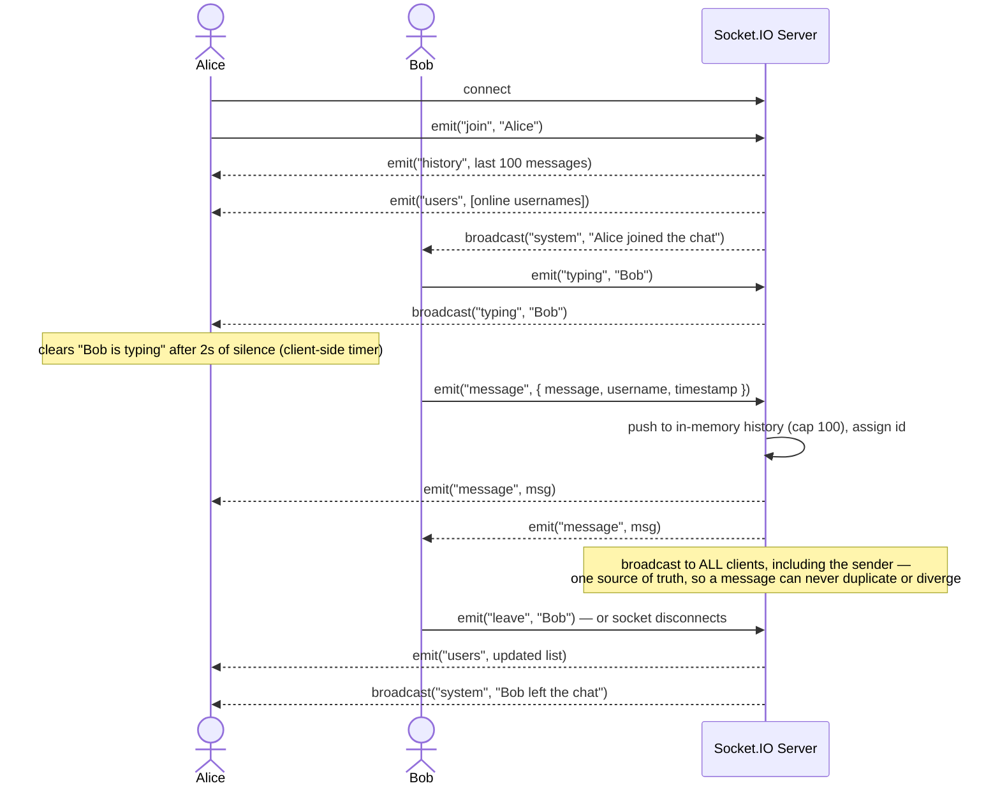
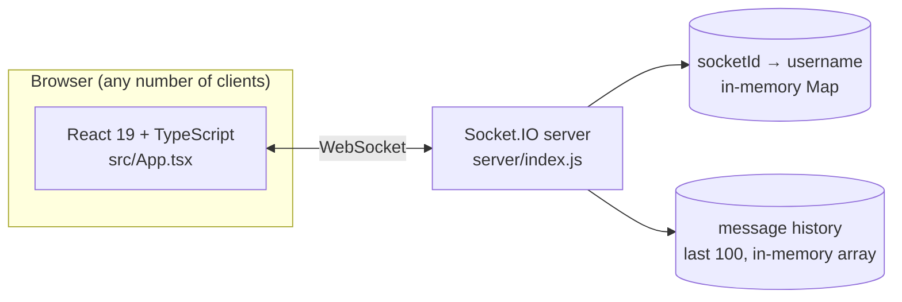

<div align="center">

# 💬 Chat App

**A real-time chat app where every client stays in sync through one Socket.IO event contract — no polling, no refresh.**

[](https://react.dev)
[](https://www.typescriptlang.org/)
[](https://socket.io)
[](https://nodejs.org)
[](https://vite.dev)
[](LICENSE)

</div>

---

Users join with a username, and every message, join/leave, presence change, and
typing signal propagates to all connected clients over a single persistent
WebSocket connection. The server is the single source of truth — it broadcasts
a sent message back to the sender too, so there's no optimistic-UI branch that
can drift out of sync with what everyone else sees.


## How it works

Six Socket.IO events carry the entire app — this is the actual flow from
`server/index.js` and `src/App.tsx`, not a simplification.



**Reconnect handling:** on `join`, the server scans its `socketId → username`
map and evicts any stale socket already registered under the same name, so a
refreshed tab doesn't leave a ghost entry in the online list.

## Status

| Feature | State |
|---|---|
| Real-time messaging over WebSockets, single-broadcast-source | ✅ |
| Message history (last 100, in-memory) replayed to new joiners | ✅ |
| Live online-user list, join/leave system messages | ✅ |
| Typing indicators with client-side 2s debounce | ✅ |
| Reconnect-safe presence (stale socket cleanup by username) | ✅ |
| Unread badge — tab title counter + notification sound on blur | ✅ |
| Emoji picker, per-user avatar colors, responsive mobile sidebar | ✅ |
| Configurable CORS origin for production (`CLIENT_ORIGIN`) | ✅ |
| Persistent history (currently in-memory, lost on server restart) | ⏳ not yet |
| Authentication (usernames are self-declared, no accounts) | ⏳ not yet |

## Quick start

Requires Node.js. Two processes: the Socket.IO server and the Vite frontend.

```bash
git clone https://github.com/devinder-dev/Chat-App.git
cd Chat-App

# Terminal 1 — Socket.IO server
cd server
npm install
cp .env.example .env
npm run dev              # http://localhost:3001

# Terminal 2 — frontend
cd Chat-App
npm install
cp .env.example .env
npm run dev               # Vite dev server, http://localhost:5173
```

<details>
<summary><b>Architecture & folder layout</b> (click)</summary>



Both server and client are intentionally single-file — the whole event
contract lives in `server/index.js`, and the whole UI in `src/App.tsx`, so
the data flow above is traceable start to end without hunting across a
folder tree.

```
Chat-App/
├── server/
│   ├── index.js          Express + Socket.IO — connection handling, all events
│   └── .env.example      PORT, CLIENT_ORIGIN
├── src/
│   ├── App.tsx            entire UI: login, sidebar, message list, input bar
│   ├── App.css
│   └── main.jsx
└── .env.example           VITE_SERVER_URL
```

| Layer | Choice |
|---|---|
| Frontend | React 19, TypeScript, Vite (rolldown-vite) |
| Backend | Node.js, Express, Socket.IO 4.8 |
| Transport | WebSocket via Socket.IO, CORS-restricted in production |
| State | In-memory only — `Map` for presence, array for history — no database |

</details>

<details>
<summary><b>Environment variables</b> (click)</summary>

**Server** (`server/.env`)

| Variable | Description | Default |
|---|---|---|
| `PORT` | Port the Socket.IO server listens on | `3001` |
| `CLIENT_ORIGIN` | Allowed browser origin for CORS (set in prod) | `*` |

**Frontend** (`.env`)

| Variable | Description | Default |
|---|---|---|
| `VITE_SERVER_URL` | URL of the backend Socket.IO server | `http://localhost:3001` |

</details>

<details>
<summary><b>Full event reference</b> (click)</summary>

| Event | Direction | Payload | Purpose |
|---|---|---|---|
| `join` | client → server | `username: string` | Registers the socket, triggers history + presence sync |
| `history` | server → joining client only | `ChatMessage[]` | Last 100 messages, sent once on join |
| `users` | server → all | `string[]` | Full online-username list, sent after any join/leave |
| `system` | server → others | `string` | Human-readable join/leave notice |
| `message` | client → server → all (incl. sender) | `{ message, username, timestamp }` → `{ id, message, username, timestamp }` | Chat message; server assigns `id` and appends to history |
| `typing` | client → server → others | `username: string` | Relayed as-is; client clears it after 2s of no repeat |
| `leave` | client → server | `username: string` | Explicit logout — removes presence, broadcasts `system` |
| `disconnect` | socket lifecycle → server → all | — | Same cleanup as `leave`, for tab close / network drop |

</details>

---

<div align="center">

**Devinder Singh** · Fullstack Developer (YH) student at Chas Academy, Stockholm

</div>
